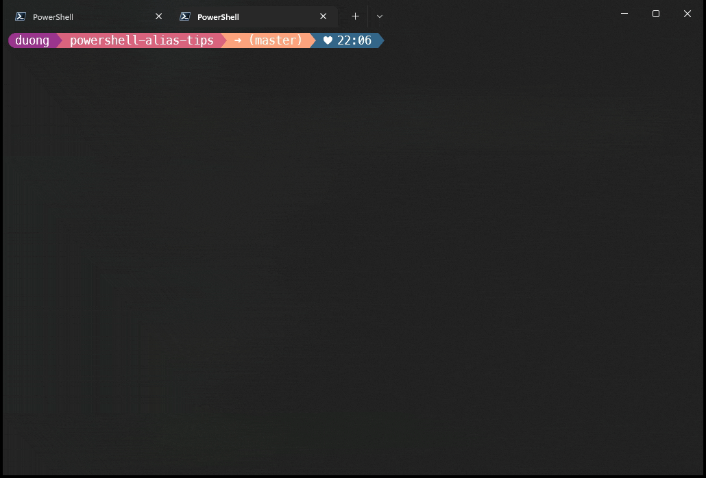

[](./LICENSE)
[](https://www.powershellgallery.com/packages/alias-tips/)
[](https://www.powershellgallery.com/packages/alias-tips/)

# Alias Tips

A [PowerShell](https://microsoft.com/powershell) module inspired by the [Oh My Zsh](https://github.com/robbyrussell/oh-my-zsh) plugin [alias-tips](https://github.com/djui/alias-tips)

> A ~~Zsh~~ PowerShell plugin to help remembering those shell aliases and Git aliases you once defined.
>
> The idea is that you might be too afraid to execute aliases defined because you can't remember them correctly, or just have forgotten about some aliases, or that aliases for your daily commands even exist.

It works by picking up all defined aliases/functions. Then it will try to compare any command you run, and see if you have an alias that might be helpful.

## Demonstration



###### Terminal is using [ `oh-my-posh` ](https://ohmyposh.dev/) with [ `M365Princess` ](https://ohmyposh.dev/docs/themes#m365princess) theme and [`git-aliases-plus`](https://github.com/codyduong/powershell-git-aliases-plus) for git aliases

------------------

```powershell
$ git status
Alias tip: gst
:

$ git checkout -b master
Alias tip: gcb master
:

$ git rebase --interactive master
Alias tip: grb --interactive master
:

$ git rebase -i master
Alias tip: grbi master
:

$ Move-Item foo bar
Alias tip: mv foo bar
:
```

View [Caveats](#caveats)

## Installation

Install from PowerShell Gallery

```powershell
Install-Module alias-tips -AllowClobber
```

## Usage

```powershell
# After declaring all your aliases, import this module
Import-Module alias-tips
```

Alternatively, use the `Find-AliasTips` command to refresh `alias-tips`.

```powershell
Import-Module alias-tips

Set-Alias g git

Find-AliasTips
```

Note that `Import-Module alias-tips` and `Find-AliasTips` can be expensive operations if you have
a lot of aliases defined. So use sparingly.

## Caveats

### Limited Aliasing Power

This tool will read all available aliases including custom aliases defined using the `function` syntax.
However, it is limited and naive in it's approach.

For example, this will get parsed by alias-tips correctly.

✅ Valid function alias
```powershell
function grbi {
	git rebase -i $args
}
```

But it will only alias tip to grbi, if the user actually uses the `-i` flag.
Alias-tips right now has no way of knowing `-i` is equivalent to `--interactive` .

Also, while there is some naive support for parsing commands inside functions, it is very naive. It will
not work when there are other PowerShell variables passed to the command.

❌ No alias tips here (yet...)
```powershell
function gcm {
	$MainBranch = Get-Git-MainBranch

	git checkout $MainBranch $args
}
```

### Overwrites `function PSConsoleHostReadLine`

Be aware if you use `function PSConsoleHostReadLine` as part of another module or your PowerShell profile, 
alias-tips will break it.

## License

Licensed under the MIT License, Copyright © 2023-present Cody Duong.

See [LICENSE](./LICENSE) for more information.
